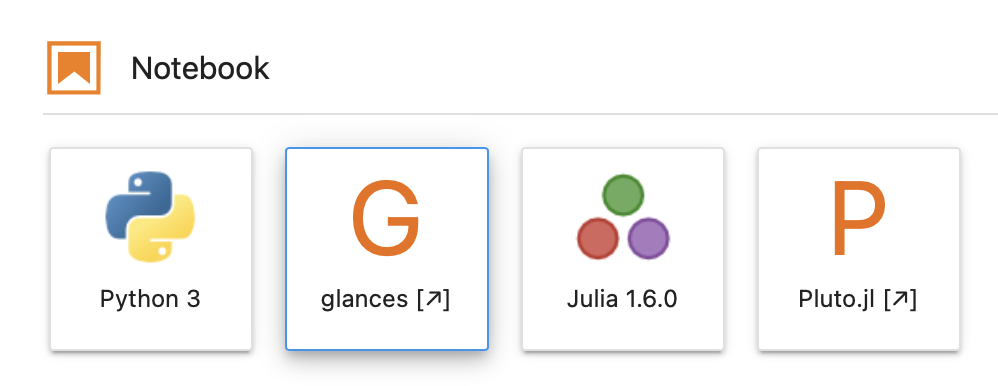

# Docker Images for Julia with JupyterLab

Dockerhub [statisticalmice/julia-jupyter](https://hub.docker.com/repository/docker/statisticalmice/julia-jupyter)  
GitHub [statisticalmice/julia-jupyter-docker](https://github.com/StatisticalMice/julia-jupyter-docker)

## Images

### Julia 1.5

`statisticalmice/julia-jupyter:1.5-buster`  
`statisticalmice/julia-jupyter:latest`

### Julia 1.6

`statisticalmice/julia-jupyter:1.6-buster`

### Layers

1. The original Julia images are built on debian:buster-slim
2. These images are built on julia:1.5-buster or julia:1.6-buster
3. Create user 'arthur'
4. Install Mambaforge
5. Install jupyterlab and jupyter-server-proxy from conda-forge
6. Install IJulia and Pluto
7. Install glances, which is a server monitoring tool with a web interface

Versions on 14 March 2021:  

|        | 1.5-buster | 1.6-buster |
|---------|-------|-----------|
| Julia   | 1.5.4 | 1.6.0-rc2 |
| Python  | 3.8.8   | 3.8.8     |
| Jupyter | 3.0.10   | 3.0.10     |
| Conda/Mamba   | 4.9.2   | 4.9.2     |
| Glances | Glances v3.1.6.2 | Glances v3.1.6.2|
| Debian  | 10.8  | 10.8      |

Other software installed include bottle, nodejs, less, nano, curl.

## Using

### Running Containers Locally

Example invocation is the following. `-ti` is required for interactive use. `--rm` removes the container after it exits. `-p 8888:8888` opens the port `8888` on your your computer and connects it to he port `8888` inside the container, which is the port Jupyter by default uses.

```text
docker run -ti --rm -p 8888:8888 statisticalmice/julia-jupyter:1.6-buster
```

Attach a host directory to the container. The container can view and edit files in this directory.

```text
-v /host/path/to/workspace:/home/arthur/workspace
```

Set the Jupyter authentication token (optional).

```text
-e JUPYTER_TOKEN=my-secret-password
```

If you set `JUPYTER_TOKEN`, open this link on your browser. Enter your token in the input labelled 'Password or token'.

```text
http://127.0.0.1:8888/lab
```

If you didn't specify a token, copy&paste the link from the command line output that looks like this.

```text
http://127.0.0.1:8888/lab?token=46303e3c454ec209005852d2e3060c0568ba019d526c09a1
```

Click to open a Python notebook, a Glances monitoring tool (in a new browser tab), a Julia notebook, or a Pluto notebook (in a new browser tab).




### How to run Pluto directly (without Jupyter)

Start the container in bash shell by attaching `bash` to the command line as follows.

```text
docker run -ti --rm -p 8888:8888 statisticalmice/julia-jupyter:1.6-buster bash
```

Start Pluto in the bash shell.

```text
julia -e "using Pluto; Pluto.run(host=\"0.0.0.0\", port=8888, launch_browser=false, require_secret_for_open_links=false, require_secret_for_access=false)"
```

Open this in a browser.

```text
http://127.0.0.1:8888/
```

## Base Images

Julia [Docker official images](https://hub.docker.com/_/julia)  
Julia [language](https://julialang.org)

## Jupyter Docker Stacks

You can find the Docker images built by the Jupyter project using the following link. The `jupyter/datascience-notebook` contains Julia.

These
* have more features
* are much larger
* are based on Ubuntu

Jupyter Docker Stacks [documentation](https://jupyter-docker-stacks.readthedocs.io/en/latest/)

## Glances documentation

[Glances](https://glances.readthedocs.io/en/latest/)

[](https://github.com/marketplace/actions/super-linter)
